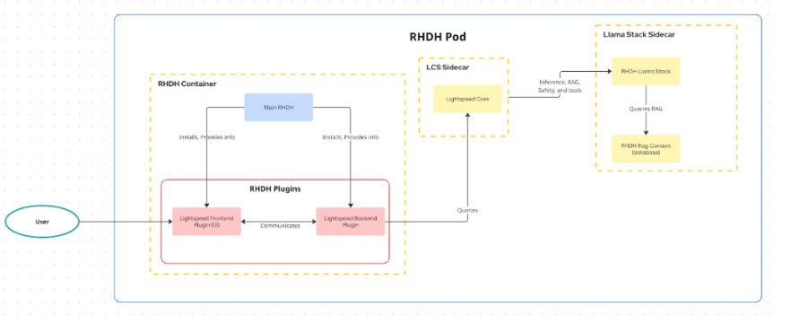

# AI Notebooks Documentation

## Quick Links

- [Overview](#overview)
- [Architecture](#architecture)
- [API Endpoints](#api-endpoints)
- [Configuration](#configuration)
- [Running the Application](#running-the-application)
- [Quick Start](#quick-start)
- [Security](#security)
- [Technical Details](#technical-details)

- **[OpenAPI/Swagger Spec](./ai-notebooks-openapi.yaml)** - Interactive API documentation

---

## Overview

AI Notebooks enables users to create custom knowledge bases for context-aware AI conversations using Retrieval Augmented Generation (RAG).
Jira Issue [RHDHIDP-9996](https://issues.redhat.com/browse/RHIDP-9996)
**ONLY BACKEND IS IMPLEMENTED AS OF 01/07/2026, FRONTEND MAY NOT REFLECT THE AI-NOTEBOOKS FEATURE. USERS SHOULD TEST THE ROUTES VIA URL OR POSTMAN**

---

## Architecture



**Components:**

1.  **Backstage Plugin**: Node.js backend handling Auth, RBAC, and request routing.
    - **Notebooks Router**: Manages Sessions and Documents via `SessionService`. Enriches chat requests with vector context.
    - **Lightspeed Router**: Proxies standard chat traffic to the Core Service.
2.  **Lightspeed Service (8080)**: Python/Go core service that handles LLM interaction and orchestration.
3.  **LlamaStack (8321)**: Provides Vector Database, Embedding generation, and LLM Provider abstractions.

---

## API Endpoints

## For detailed API documentation, please refer to the [OpenAPI Specification](./ai-notebooks-openapi.yaml)

## Configuration

### Prerequisites

To run the required backend services locally, please follow the instructions in these repositories:

- **Llama Stack**: [https://github.com/JslYoon/llama-stack](https://github.com/JslYoon/llama-stack)
- **Lightspeed Stack**: [https://github.com/JslYoon/lightspeed-stack/tree/temp-llama-stack-0.2.x](https://github.com/JslYoon/lightspeed-stack/tree/temp-llama-stack-0.2.x)

---

## Running the Application

### Development

```bash
# From workspace root (workspaces/lightspeed/)

# Install dependencies
yarn install

# Start full dev environment
yarn dev

```

---

## Quick Start

### 1. Create a Session

```bash
curl -X POST http://localhost:7007/api/lightspeed/v1/sessions \
  -H "Content-Type: application/json" \
  -d '{
    "name": "My Research Session",
    "description": "Research on RHDH"
  }'
```

### 2. Upload Documents

**Upload PDF:**

```bash
curl -X POST http://localhost:7007/api/lightspeed/v1/sessions/SESSION_ID/documents/upload \
  -F "file=@./documentation.pdf" \
  -F "fileType=pdf" \
  -F "title=API Documentation"
```

**Upload Markdown:**

```bash
curl -X POST http://localhost:7007/api/lightspeed/v1/sessions/SESSION_ID/documents/upload \
  -F "file=@./README.md" \
  -F "fileType=md"
```

**Upload URL:**

```bash
curl -X POST http://localhost:7007/api/lightspeed/v1/sessions/SESSION_ID/documents/upload \
  -H "Content-Type: application/json" \
  -d '{
    "fileType": "url",
    "file": "https://example.com/documentation.html",
    "title": "External Documentation"
  }'
```

### 3. Query with RAG

```bash
curl -X POST http://localhost:7007/api/lightspeed/v1/sessions/SESSION_ID/query \
  -H "Content-Type: application/json" \
  -d '{
    "query": "Summarize key features from the uploaded document",
    "model": "meta-llama/Llama-3.1-8B-Instruct",
    "provider": "llamastack"
  }'
```

---

## Security

### Architecture

The plugin integrates with the standard Backstage Security Framework to ensure data privacy and access control.

1.  **Authentication**: Identity is established via the Backstage `HttpAuthService`.
2.  **Authorization**: Access to endpoints is guarded by the Backstage `PermissionsService`.
3.  **Data Isolation**: Sessions and documents are scoped to the authenticated user identity.

### Session Management

Sessions serve as the secure container for user data and knowledge bases.

- **Ownership**: Every session is stamped with the creating user's Entity Reference (e.g., `user:default/alice`) upon creation.
- **Access Control**: The `SessionService` strictly enforces ownership checks. Users can only list, read, or modify sessions that match their user ID.
- **Vector Isolation**: Each session maintains its own isolated vector database index in LlamaStack, ensuring that documents from one session never leak into the context of another.

---

## Technical Details

### Session ID Format

```
session-{sanitized_user}-{timestamp}-{random}
```

**Example**: `session-user-default-guest-1704657600000-abc123`

### Document Chunking

- **Chunk Size**: 512 words
- **Embedding Model**: sentence-transformers/all-mpnet-base-v2 (768 dimensions)
- **Storage**: LlamaStack vector database (one per session)

### Supported File Types

| Type       | Extensions               | Max Size | Parsing                                |
| ---------- | ------------------------ | -------- | -------------------------------------- |
| Text       | `.md`, `.txt`, `.log`    | 20MB     | UTF-8 text                             |
| Structured | `.json`, `.yaml`, `.yml` | 20MB     | Validated & formatted                  |
| Binary     | `.pdf`                   | 20MB     | pdfjs-dist text extraction             |
| URL        | `url`                    | N/A      | Fetches and extracts HTML/text content |

### PDF Parsing

- **Library**: pdfjs-dist v4.10.38
- **Supports**: Text-based PDFs (no OCR)
- **Format**: Page markers (`--- Page 1 ---`) with extracted text

### RAG Context

Each query includes:

1. **Session documents** (via session vector DB)
2. **RHDH product docs** (via static `rhdh-product-docs-1_8` vector DB)

### Conversation Isolation

- **Developer chat**: `conv-123` (no prefix)
- **Notebook chat**: `nb-conv-123` (prefixed with `nb-`)

---

**Last Updated**: 2026-01-07
